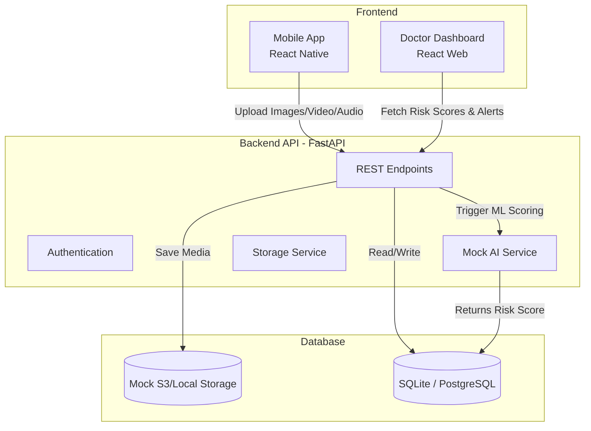

# System Architecture: HealSense

## High-Level Architecture Diagram

## AI Backend Integration Architecture
1. **Wound Analysis:** Simulated ResNet-50 CNN model endpoint that receives wound images and returns an Infection Risk score (0-100%).
2. **Gait Analysis:** Simulated Pose Estimation endpoint that analyzes walking videos and returns a Mobility score.
3. **Pain Detection:** Simulated Speech/MFCC endpoint that parses daily voice recordings and extracts a subjective Pain/Discomfort score.
4. **Multimodal Risk Engine:** Combines the three scores into an overall `Recovery Risk Score`. If this score exceeds 75, an `Alert` is triggered on the Doctor Dashboard.

## Storage and Database (Hackathon Implementation)
- **Database:** SQLite (for rapid local setup) managed via SQLAlchemy ORM.
- **File Storage:** Local file system mimicking AWS S3 buckets (e.g. `uploads/images/`, `uploads/videos/`).

## Local Setup
1. Clone monorepo.
2. Start FastAPI server (`uvicorn main:app --reload`).
3. Start React web server (`npm run dev`).
4. Start Expo React Native app (`npx expo start`).
